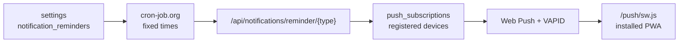

# Canopy Notifications

Canopy uses the lightweight reminder architecture: three fixed daily reflection reminders, Web Push delivery, and no reminders table.

## Data Model



`push_subscriptions` is the only new table. It stores one row per user device:

- `id`
- `user_id`
- `endpoint`
- `p256dh`
- `auth`
- `device_name`
- `platform`
- `enabled`
- `created_at`
- `updated_at`

Reminder preferences live in the existing `settings` table under `notification_reminders`.

Duplicate protection also uses `settings`, with one marker per user, date, and reminder type. This preserves the “no reminders table” constraint while preventing duplicate sends if cron-job.org retries the same endpoint.

## API

- `GET /api/notifications/vapid-public-key`
- `GET /api/notifications/subscriptions`
- `POST /api/notifications/subscribe`
- `POST /api/notifications/unsubscribe`
- `GET /api/notifications/reminder-settings`
- `PUT /api/notifications/reminder-settings`
- `POST /api/notifications/test`
- `POST /api/notifications/reminder/{morning|afternoon|evening}`

The fixed reminder endpoint requires:

```http
Authorization: Bearer <REMINDER_CRON_SECRET>
```

## Production Environment

Set these on the backend host:

```bash
VAPID_PUBLIC_KEY=...
VAPID_PRIVATE_KEY=...
VAPID_SUBJECT=mailto:you@example.com
REMINDER_CRON_SECRET=<long random value>
```

Generate VAPID keys:

```bash
npx web-push generate-vapid-keys
```

## cron-job.org

Create three jobs. Match the times to the values shown in Canopy Settings:

- `09:00` -> `POST https://<api-host>/api/notifications/reminder/morning`
- `14:00` -> `POST https://<api-host>/api/notifications/reminder/afternoon`
- `20:00` -> `POST https://<api-host>/api/notifications/reminder/evening`

Add the authorization header to each job:

```http
Authorization: Bearer <REMINDER_CRON_SECRET>
```

## Client Flow

The sidebar bell and Settings page both use `useNotificationToggle()`. The hook registers `notification-sw.js`, requests notification permission, subscribes the current device with the VAPID public key, and sends the subscription to the backend.

On GitHub Pages, the hook detects the `/canopy` base path and registers `/canopy/notification-sw.js`. This avoids the common static-export failure where the browser tries to load a service worker from a missing root or app-prefixed path. Notifications are delivered through the service worker, so the installed PWA does not need to be open.
