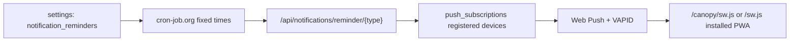

# Canopy Notifications

Canopy uses a lightweight reminder architecture: opt-in reflection reminders, Web Push delivery, and no reminders table. The default is a single evening diary reminder at `21:30` IST; morning and afternoon check-ins remain available but disabled by default. Reminder copy rotates through curated variants by IST date so enabled nudges do not use the same fixed message every day. Groq is not called during cron delivery.

## Data Model



`push_subscriptions` stores one row per user device:

- `id`
- `user_id`
- `endpoint`
- `p256dh`
- `auth`
- `device_name`
- `platform`
- `enabled`
- `created_at`
- `updated_at`

When a device subscribes, Canopy re-enables or creates the current browser endpoint and disables older enabled endpoints with the same `device_name` and `platform`. Unsubscribing sends that same device profile and also retires stale matches. This preserves multi-device delivery while avoiding duplicate reflection reminders when a browser rotates its Web Push endpoint.

Reminder preferences live in the existing `settings` table under `notification_reminders`.

Duplicate protection also uses `settings`, with one marker per user, UTC date, and reminder type. This preserves the "no reminders table" constraint while preventing duplicate sends if cron-job.org retries the same endpoint.

## API

- `GET /api/notifications/vapid-public-key`
- `GET /api/notifications/subscriptions`
- `POST /api/notifications/subscribe`
- `POST /api/notifications/unsubscribe`
- `GET /api/notifications/reminder-settings`
- `PUT /api/notifications/reminder-settings`
- `POST /api/notifications/test`
- `POST /api/notifications/reminder/{morning|afternoon|evening}`

The fixed reminder endpoint requires:

```http
Authorization: Bearer <REMINDER_CRON_SECRET>
```

The reminder endpoint returns delivery stats:

```json
{
  "users": 1,
  "attempted_subscriptions": 2,
  "delivered": 2,
  "sent": 1,
  "skipped": 0,
  "subscriptions_disabled": 0,
  "delivery_errors": 0,
  "errors": []
}
```

`sent` is the number of users who received at least one notification. `delivered` is the number of device subscriptions that accepted a push. `skipped` means the user had reminders disabled, that reminder type disabled, or a duplicate-send marker already existed for the day.

If Canopy attempts delivery and every attempted push fails, the endpoint returns HTTP 502 with the same stats under `detail.stats`. This lets cron-job.org show a failed run instead of a misleading green success.

## Production Environment

Set these on the backend host:

```bash
VAPID_PUBLIC_KEY=...
VAPID_PRIVATE_KEY=...
VAPID_SUBJECT=mailto:you@example.com
REMINDER_CRON_SECRET=<long random value>
```

Generate VAPID keys:

```bash
npx web-push generate-vapid-keys
```

Run the database initializer against the production PostgreSQL database after deploying this feature, because production Vercel normally has `INIT_DB_ON_STARTUP=false`:

```powershell
cd backend
$env:DATABASE_URL="postgresql://..."
python -m app.database
```

If `/api/health` and `/api/notifications/vapid-public-key` work but enabling the bell shows a network-style error, the usual cause is that `push_subscriptions` has not been created in the production database yet.

## cron-job.org

Create cron jobs for the enabled reminder types. Match the job times to the values shown in Canopy Settings. The backend stores the preferred times and enabled types, but cron-job.org is still the scheduler. Defaults use 30-minute boundaries:

- `11:00` -> `POST https://<api-host>/api/notifications/reminder/morning`
- `15:00` -> `POST https://<api-host>/api/notifications/reminder/afternoon`
- `21:30` -> `POST https://<api-host>/api/notifications/reminder/evening`

For the current diary-style setup, keep only the evening job active unless morning or afternoon reminders are explicitly enabled in Settings.

Add the authorization header to each job:

```http
Authorization: Bearer <REMINDER_CRON_SECRET>
```

Set the cron timezone deliberately. Reminder duplicate protection uses the backend's UTC date, so a late-night local run can count against the adjacent UTC date. This only affects duplicate suppression, not whether Web Push can be delivered.

## Client Flow

The sidebar bell and Settings page both use `useNotificationToggle()`. The hook registers `sw.js`, requests notification permission, subscribes the current device with the VAPID public key, and sends the subscription to the backend.

On GitHub Pages, the hook detects the `/canopy` base path and registers `/canopy/sw.js`. This avoids the common static-export failure where the browser tries to load a service worker from a missing root or app-prefixed path. Notifications are delivered through the service worker, so the installed PWA does not need to be open.

## Troubleshooting

If cron-job.org says success but devices did not receive a notification:

1. Open the cron execution details and inspect the response body, not just the HTTP status.
2. `sent: 0` with `skipped > 0` means Canopy intentionally skipped the user because reminders/type were disabled or the same UTC date/type had already been sent.
3. `attempted_subscriptions > 0`, `delivered: 0`, and `delivery_errors > 0` means the push provider rejected delivery. The endpoint now returns HTTP 502 for this all-failed case.
4. Use Settings -> Reminders -> Send test from the same signed-in account. A zero-delivery result with errors points to VAPID, subscription, browser, or platform delivery issues rather than cron timing.
5. Confirm the user is signed in and the device was enabled after the current VAPID public key was deployed. Changing VAPID keys usually requires disabling and re-enabling the device subscription.
6. Confirm these backend variables exist in the hosted API environment: `VAPID_PUBLIC_KEY`, `VAPID_PRIVATE_KEY`, `VAPID_SUBJECT`, and `REMINDER_CRON_SECRET`.
7. Confirm `push_subscriptions` exists in the production database by running the database initializer against the production `DATABASE_URL`.

Device settings can be correct and delivery can still fail if the stored browser subscription is stale, was created with a previous VAPID key, or the push provider rejects the request. In that case disable notifications in Canopy, enable them again, and send a test notification before waiting for the next cron run.
